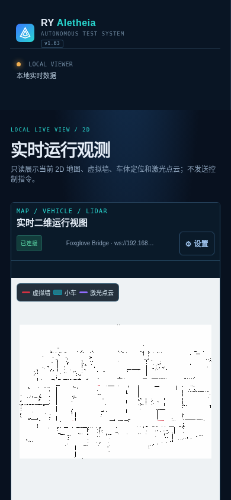
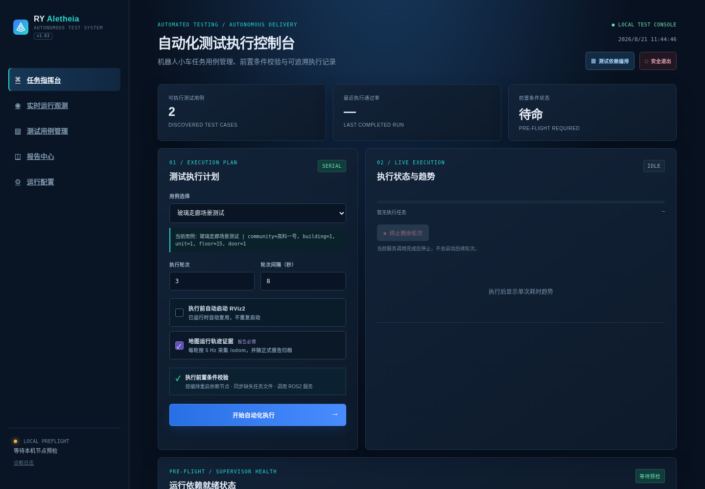
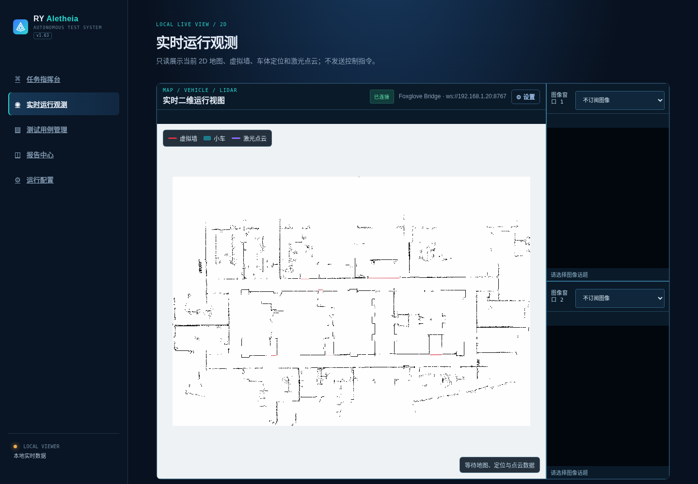
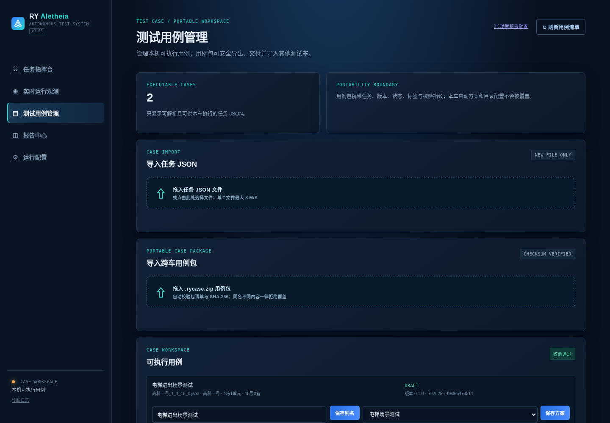
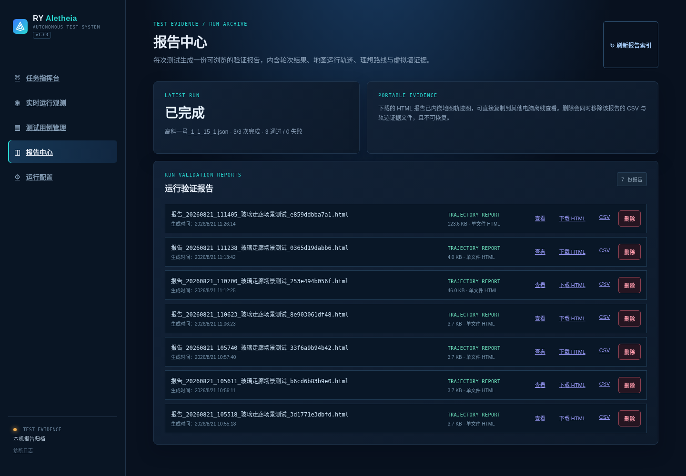
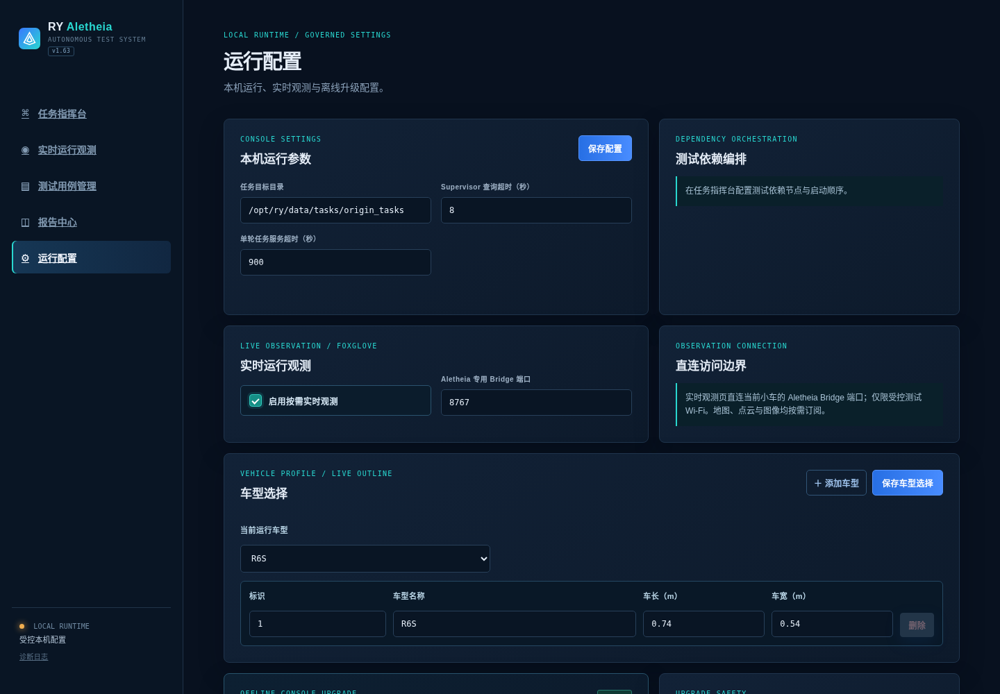
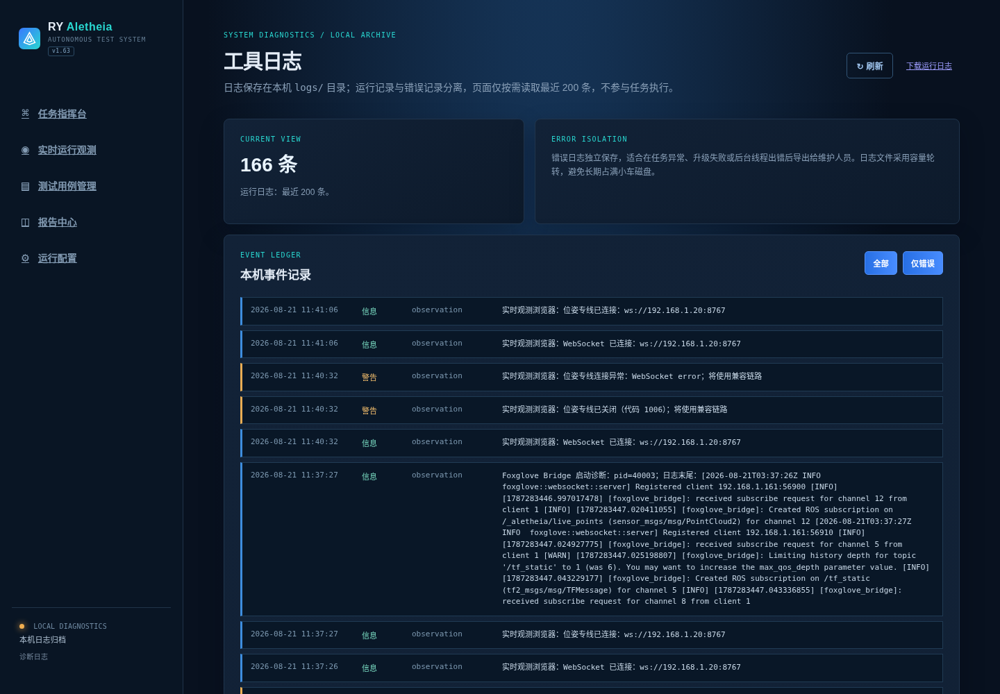
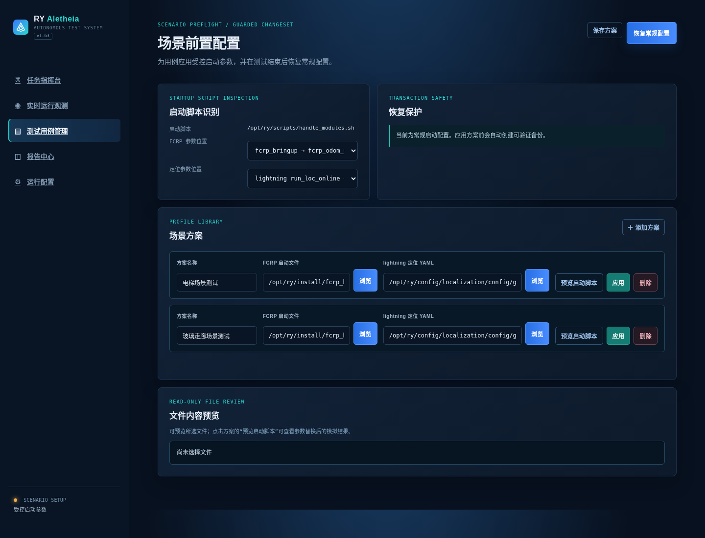

# RY Aletheia 自动测试平台

RY Aletheia 用于机器人小车自动测试：管理测试用例、按规则恢复运行依赖、执行多轮任务、记录轨迹，并生成测试报告。

工具运行在小车本机。测试电脑只需连接小车 Wi-Fi，再通过浏览器访问小车页面；正常使用不需要互联网、不需要手动执行 ROS2 命令，也不需要理解工具源码。

> 本文面向测试人员与部署人员。开发、构建和系统维护说明见 [PROJECT_OVERVIEW.md](PROJECT_OVERVIEW.md)。

## 目录

- [1. 安装前准备](#1-安装前准备)
- [2. 首次安装](#2-首次安装)
  - [工具数据目录说明](#工具数据目录说明)
- [3. 启动、访问与停止](#3-启动访问与停止)
  - [手机与平板访问](#手机与平板访问)
- [4. 界面导览：先认识主要功能页](#4-界面导览先认识主要功能页)
  - [任务指挥台](#41-任务指挥台从这里开始执行测试)
  - [实时运行观测](#42-实时运行观测只读查看现场)
  - [测试用例管理](#43-测试用例管理导入校验与交付)
  - [报告中心](#44-报告中心查看和导出测试证据)
  - [运行配置](#45-运行配置只在需要时调整)
  - [工具日志](#46-工具日志异常时导出给维护人员)
- [5. 第一次使用前配置](#5-第一次使用前配置)
- [6. 执行一次测试](#6-执行一次测试)
- [7. 停滞、失败与人工恢复](#7-停滞失败与人工恢复)
- [8. 报告与轨迹](#8-报告与轨迹)
- [9. 工具升级](#9-工具升级)
- [10. 卸载](#10-卸载)
- [11. 常见问题](#11-常见问题)

## 1. 安装前准备

请确认：

- 小车已正常启动，自动驾驶软件和 Supervisor 可用。
- 安装操作使用具有 `sudo` 权限的账户；工具实际运行使用普通账户（通常是 `ry`）。
- 已取得对应版本的 `ry-aletheia_<版本号>_amd64.deb` 完整离线首次安装包。
- 测试电脑与小车连接同一 Wi-Fi，并知道小车 IP 地址。

工具不会设置开机自启。只有在需要测试时手动启动。

## 2. 首次安装

将 `.deb` 文件复制到小车任意目录，例如“下载”目录，然后在终端执行：

```bash
cd <安装包所在目录>
sudo dpkg -i ./ry-aletheia_<版本号>_amd64.deb
```

完整离线 DEB 已内置本工具专用的 Foxglove Bridge，推荐始终使用 `dpkg -i` 安装。这样不会因小车系统中与本工具无关的 APT 未完成依赖而阻塞安装。请勿对完整包执行 `apt autoremove`；如 `dpkg` 提示该 DEB 自身缺少依赖，再将完整错误信息提供给维护人员。

安装程序会自动：

- 识别小车普通运行账户，并部署到 `/home/<普通账户>/ry_aletheia/`；
- 配置工具所需的受限 Supervisor 权限；
- 创建任务、配置、报告、地图缓存和升级目录；
- 保留小车原有自动驾驶软件，不替换其 ROS2、导航、定位或 Supervisor 配置；
- 保持工具停止，不设置开机自启。

安装成功后，终端会显示启动命令：`ry-aletheia`。

### 工具数据目录说明

工具安装在 `/home/<普通账户>/ry_aletheia/`。日常使用时只需要关注以下数据目录；通过网页完成操作优先于直接修改文件。

| 目录 | 保存内容 | 使用说明 |
| --- | --- | --- |
| `tasks/` | 已导入的测试任务 JSON | 可从“测试用例管理”导入；也可在未执行测试时复制任务文件到此处。不要覆盖已有同名任务。 |
| `config/` | 运行配置、车型、依赖编排、场景方案和用例信息 | 由网页自动维护。不要手动编辑或删除，以免配置不一致。 |
| `reports/` | 已完成测试的 HTML/CSV 报告和轨迹证据 | 可在“报告中心”查看、下载或删除；建议定期导出需要长期保存的报告。 |
| `maps_cache/` | 地图、虚拟墙与实时观测所需的缓存 | 由工具自动更新。地图显示异常时请先联系维护人员，勿在测试中手动删除。 |
| `updates/` | 升级 ZIP 暂存文件及当前版本的唯一备份 | 由离线升级流程管理；不要手动清理正在升级或用于回退的文件。 |
| `runtime/foxglove_bridge/` | 工具私有的 Foxglove Bridge | 由完整离线安装包维护，不会改动小车系统 ROS；不要手动替换或删除。 |
| `logs/` | 工具、实时观测和错误诊断日志 | 页面出现异常时，从“工具日志”导出诊断信息提供给维护人员。 |

除非维护人员明确要求，请不要删除整个 `ry_aletheia/` 目录，也不要改动其中的程序文件。任务、配置和报告需要备份时，优先通过网页导出；手动备份时仅复制上述数据目录，且必须在没有执行中测试、升级或人工恢复流程时进行。

## 3. 启动、访问与停止

### 启动工具

在小车普通账户的终端执行：

```bash
ry-aletheia
```

工具会自动加载小车 ROS2 运行环境。请不要使用 `sudo ry-aletheia`，也不要使用 `sudo ./dist/ry-aletheia`。

启动后，测试电脑在浏览器打开：

```text
http://<小车IP>:8087
```

例如：`http://192.168.1.20:8087`。

如果浏览器无法访问，请先确认电脑和小车在同一 Wi-Fi，再确认 IP 地址无误。

### 手机与平板访问

手机、平板和电脑使用同一个访问地址。系统会自动为手机和平板打开移动端界面，电脑端仍保持原有桌面布局不变；如需临时切回电脑布局，可在移动端菜单中选择“使用桌面版”。

移动端的所有页面和功能与电脑端一致，只是导航与表单会改为更适合触控的单列布局。实时运行观测页面可点击“全屏地图”：全屏时只显示地图、车体和点云，横屏、竖屏都可使用；点击“退出全屏”即可回到完整页面。该功能仅改变显示方式，不会向小车发送控制指令。



手机上建议优先使用竖屏完成用例选择、配置和报告查看；需要持续观察地图时再旋转为横屏并进入“全屏地图”。小屏幕上连接地址可能会缩略显示，这是正常的界面适配，连接状态以绿色“已连接”标识为准。

### 停止工具

优先在网页右上角点击“安全退出”。确认页面提示已退出后，8087 端口会停止监听。

也可以回到启动工具的终端按 `Ctrl+C` 结束。关闭浏览器不会停止工具。

如果提示端口 `8087` 已被占用，通常表示工具已经在运行；不要重复启动，直接访问网页或使用“安全退出”。

### 查看资源占用

在小车终端执行：

```bash
ry-aletheia-status
```

它每秒显示一次工具的 CPU、内存、线程数和运行时长。按 `Ctrl+C` 退出查看；该命令不会额外启动常驻监控进程。

## 4. 界面导览：先认识主要功能页

打开首页后，左侧导航可进入以下页面。首次使用建议按“运行配置 → 测试用例管理 → 任务指挥台 → 报告中心”的顺序熟悉；实时运行观测可在测试前后随时打开查看。

| 页面 | 用途 | 什么时候使用 |
| --- | --- | --- |
| **任务指挥台** | 选择用例、设置轮次、查看预检和执行进度 | 每次启动自动化测试时使用。 |
| **实时运行观测** | 查看地图、车体、虚拟墙和激光点云 | 需要确认车辆现场状态时使用；不发送控制指令。 |
| **测试用例管理** | 导入、校验、命名、导出或归档测试用例 | 新增、交付或整理任务 JSON 时使用。 |
| **报告中心** | 查看、下载和删除已完成测试的报告与轨迹 | 一轮或一批测试完成后使用。 |
| **运行配置** | 配置实时观测、车型、依赖编排和离线升级 | 首次使用、小车软件环境变更或升级工具时使用。 |
| **工具日志** | 导出运行和错误诊断信息 | 页面异常、升级失败或需要维护支持时使用。 |

### 4.1 任务指挥台：从这里开始执行测试



任务指挥台是日常测试的主页面。顶部卡片显示当前已发现用例、最近结果与预检状态；中部“测试执行计划”用于选择任务、设置轮次和间隔；下方依次显示依赖节点状态、执行进度与每轮记录。

使用步骤：

1. 在“用例选择”中选中本次要执行的任务，并核对下方场景信息。
2. 设置执行轮次和轮次间隔。首次验证建议先执行 1 轮，确认现场与依赖恢复流程无误后再增加轮次。
3. 按需要勾选“执行前自动启动 RViz2”和“地图运行轨迹证据”。轨迹证据会进入报告，建议正式测试保持勾选。
4. 阅读“执行前置条件校验”区域。只有全部条件满足后，才点击“开始自动化执行”。
5. 执行中通过“执行状态与趋势”“本轮线路进度”“执行记录”查看状态；不要通过刷新页面或重复点击开始按钮干预运行。

开始前请确认页面没有红色预检提示，车辆周围安全、急停状态正确，并由现场人员确认车辆可以自主运动。

### 4.2 实时运行观测：只读查看现场



实时运行观测是只读页面，不会发送驾驶、导航或任务控制指令。主画面从低到高依次叠加静态地图、红色虚拟墙、青色车体和紫色激光点云；右侧可按需选择图像话题。顶部绿色“已连接”表示已连接工具专用 Bridge，状态栏会显示地图、定位和点云的等待或接收情况。

使用步骤：

1. 首先在“运行配置”中启用“按需实时观测”，再进入本页。
2. 等待地图加载。车体和点云出现前，右下角会显示“等待地图、定位与点云数据”；这表示页面正在等待上游数据，并不代表工具向车辆发出了指令。
3. 用图例确认显示内容：红色为虚拟墙、青色为小车、紫色为激光点云。需要集中查看时，手机端可进入“全屏地图”。
4. 图像话题只在确有诊断需要时订阅；不需要时保持“不订阅图像”，以减少网络与设备负担。

若页面持续只有地图或持续显示等待数据，请刷新本页一次并等待约 10 秒；仍不能恢复时进入“工具日志”导出诊断信息，不要在运行中的测试中手动重启车辆节点。

### 4.3 测试用例管理：导入、校验与交付



测试用例管理用于维护本车可执行任务。页面上方区分普通任务 JSON 与跨车 `.rycase.zip` 用例包；下方每张用例卡片显示任务来源、场景信息、校验结果、别名、绑定的场景方案及交付状态。

使用步骤：

1. 导入本车任务时，把 JSON 拖入“导入任务 JSON”区域，等待页面完成校验。
2. 从其他测试车接收标准化任务时，拖入 `.rycase.zip`。系统会核对包清单和 SHA-256，拒绝同名但内容不同的文件，避免误覆盖。
3. 在“可执行用例”卡片中填写便于识别的场景别名；需要特定定位或启动参数时，选择相应场景前置方案并保存。
4. 仅在用例已通过实车验证后，再通过“用例管理与交付”填写版本、状态、标签和说明并导出。

导入成功不等同于实车通过。页面的“校验通过”只表示文件结构可解析；仍应先执行低风险单轮测试验证现场条件。

### 4.4 报告中心：查看和导出测试证据



每次已完成的测试计划都会生成一份报告。页面顶部展示最近一次运行结果；下方列表按报告逐项提供“查看”“下载 HTML”“CSV”和“删除”。HTML 报告已内嵌地图轨迹图，复制到其他电脑后可离线浏览；CSV 适合做统计或导入其他分析工具。

使用步骤：

1. 测试完成后点击“刷新报告索引”，确认新报告已出现在列表中。
2. 先点击“查看”核对用例、轮次结果、轨迹、理想路线和虚拟墙证据。
3. 需要归档或交付时下载 HTML；需要进一步统计时下载 CSV。
4. 仅在报告已完成外部备份且确认无保留价值时再点击“删除”。删除会同时移除对应 CSV 与轨迹证据，无法恢复。

### 4.5 运行配置：只在需要时调整



运行配置集中管理工具级设置：本机运行参数、测试依赖编排入口、实时观测开关与端口、车型轮廓以及离线升级。日常执行同一类测试时一般不需要反复修改；只有首次启用实时观测、调整车型、变更依赖编排或安装升级 ZIP 时才进入此页。

使用步骤：

1. 修改任务目录或超时时间后，点击“保存配置”。除非已确认小车软件环境变化，否则不要任意缩短超时。
2. 需要实时观测时勾选“启用按需实时观测”；端口默认是 `8767`，仅在确认端口冲突时才改为已确认空闲的端口。
3. 在“车型选择”中选择实际车型，或者添加车型后填写车长、车宽并保存。车体轮廓仅影响观测显示，不会改变车辆控制参数。
4. 需要调整节点启动顺序时，从任务指挥台的“测试依赖编排”进入配置；不要把无关节点加入编排。
5. 日常升级时拖入维护人员提供的升级 ZIP，确认没有执行中任务后点击“校验并应用升级”。

> 截图中的任务名称、车型、端口和版本号仅为界面示例，应以当前小车和当前页面显示的信息为准。

### 4.6 工具日志：异常时导出给维护人员



工具日志只读取本机最近的运行与错误记录，不参与任务执行。每一行都包含时间、级别、模块和事件内容；“全部”和“仅错误”可快速切换视图，右上角“下载运行日志”用于将诊断信息交给维护人员。

使用步骤：

1. 页面异常、升级失败、实时观测无数据或任务无法开始时，先点击“刷新”。
2. 选择“仅错误”，记录异常出现的大致时间、所在页面和看到的提示。
3. 点击“下载运行日志”，将下载文件和上述现象一起提供给维护人员。

日志中可能包含节点名称、端口、运行时间和内部诊断信息。请只将其发送给本项目维护人员，不要公开发布；日志下载与查看不会改变小车运行状态。

## 5. 第一次使用前配置

首次进入网页后，建议按以下顺序完成配置。配置会自动保存；刷新网页、重启工具或日后升级后都不需要重新填写。

### 5.1 添加测试用例

**为什么要添加用例：** 工具只会执行已通过校验的任务 JSON。将任务集中放在“测试用例管理”，可避免在任务指挥台中误选文件，也便于后续统计和追溯。

进入“测试用例管理”，将任务 JSON 文件拖入页面，或将文件复制到：

```text
/home/<普通账户>/ry_aletheia/tasks/
```

页面会校验文件。通过后，为每个用例设置易懂的别名，例如“电梯上行回归测试”。任务指挥台会优先显示别名；没有别名时才显示源文件名。

“测试用例管理”页面及导入区域见上文[测试用例管理](#43-测试用例管理导入校验与交付)。导入后请在页面下方确认该用例显示为“校验通过”，再进入后续绑定与测试步骤。

对于已在实车验证、需要交给其他测试车继续使用的用例，在“用例管理与交付”中补充版本、状态、标签和说明，然后选择“导出用例包”。接收车辆在同一页面拖入 `.rycase.zip` 即可导入。导入会校验任务指纹；同名但内容不同的文件会被拒绝，绝不会覆盖本车任务。场景前置方案、依赖节点编排和本车目录配置均不会随包带入，需由接收车辆按自身环境单独绑定。

### 5.2 配置场景前置方案（按需）

**什么时候需要：** 同一台小车在不同场地、楼层或测试场景下，可能需要使用不同的定位 YAML 或 FCRP 启动文件。例如电梯厅测试与室外测试通常不能共用同一套参数。

**为什么要在工具中配置：** 不需要测试人员每次手动编辑小车文件。工具会在测试前替换已选参数、在测试后恢复常规参数，并保留备份，降低改错或忘记恢复的风险。

如果不同用例需要不同的定位或导航启动参数，在“测试用例管理”中进入“场景前置配置”：



1. 从工具提供的文件浏览器选择 FCRP 启动文件和 lightning 配置文件。
2. 填写方案名称并保存。
3. 将方案绑定到对应测试用例。

配置页面顶部的“启动脚本识别”用于确认工具将替换的参数位置；首次配置时应先核对识别结果。每个场景方案都可先点击“预览启动脚本”，确认目标文件和模拟替换结果正确后再点击“应用”。工具在应用前会创建可验证备份；若需要立即退出某个临时方案，可点击右上角“恢复常规配置”。

执行该用例前，工具会自动应用方案；测试完成、终止或人工恢复结束后，会自动恢复常规启动配置。不要在测试过程中手动修改对应启动脚本。

### 5.3 配置测试依赖节点编排

**为什么需要节点编排：** 小车上电后，许多节点虽然显示为 `RUNNING`，但其中的定位、导航或任务服务可能仍保留上一轮测试的状态。直接下发下一条任务，容易出现定位未恢复、地图未加载完成或任务服务尚未准备好的失败。

依赖节点编排会在每次测试开始及人工恢复后，按你设定的顺序重新启动必要节点，并等待它们真正稳定为 `RUNNING` 后才下发任务。这样每轮测试都尽可能从相同的初始软件状态开始，测试结果更可重复、更可信。

**什么时候需要重新配置：** 小车软件升级后节点名称变化、增加新的依赖节点、启动顺序调整，或某个场景需要额外服务时，应重新识别并调整编排。

在“任务指挥台”右上角进入“测试依赖编排”：


1. 点击识别，读取小车当前 Supervisor 节点。
2. 选择本测试依赖的节点。
3. 根据实际启动顺序划分阶段：同一阶段可同时启动；后一阶段会等待前一阶段全部就绪。
4. 为需要额外初始化时间的阶段设置稳定等待时间。
5. 保存编排。

每次测试开始或人工恢复后，工具会先按编排恢复节点，并等待所需节点稳定为 `RUNNING`，再下发任务。

> 建议只加入本测试真正依赖的节点。节点过多会增加恢复等待时间；漏掉关键节点则可能导致任务无法执行。第一次配置后，可先用 1 轮低风险测试确认顺序正确。

### 5.4 可选：实时运行观测

**为什么是可选：** 实时观测用于辅助确认定位、点云和车辆运行情况，不参与任务成功判定。资源紧张或仅需要批量跑回归测试时，可以不启用，以减少额外资源占用。

“实时运行观测”可查看地图、虚拟墙、车体、激光点云和可选图像话题，仅用于观察，不会发送驾驶控制指令。

在“运行配置”启用该功能后进入观测页面即可。默认端口为 `8767`；若页面提示端口被占用，请在运行配置中改为小车上确认空闲的端口后重试。不要使用小车系统已占用的端口。

观测页中地图始终保持原始地图朝向，只有小车图标随实时航向旋转。系统优先保证车体位姿：点云采用低延迟最新帧显示，网络或设备短暂繁忙时允许跳过旧扫描，不能为补绘历史数据而拖慢画面。若需要排查延迟，请保持页面打开约 10 秒后联系维护人员读取观测遥测；不要通过提高点云队列或同时开启非必要原始图像话题来“补帧”。

点云传输采用低延迟最新帧策略，网页为保障小车位姿与地图交互流畅会主动限制点云刷新频率；这不是激光雷达故障。若页面持续显示“等待点云”，请刷新页面一次；仍未恢复时，在“工具日志”中导出诊断信息并联系维护人员。请不要在测试过程中自行重启小车节点或更改运行配置。

在手机端使用实时观测时，建议需要集中查看地图时进入“全屏地图”，需要切换页面或查看连接状态时退出全屏；旋转手机不会中断观测。

观测界面的完整说明与图例见上文[实时运行观测](#42-实时运行观测只读查看现场)。

## 6. 执行一次测试


1. 进入“任务指挥台”。
2. 选择用例，设置执行轮次和轮次间隔。
3. 根据需要勾选“执行前自动启动 RViz2”和“地图运行轨迹证据”。
4. 点击“开始自动化执行”，在确认窗口中确认计划。

工具会自动完成：场景方案应用、依赖节点恢复、任务文件检查、ROS2 服务检查和任务下发。仅在全部前置条件满足后才开始第一轮。

执行期间可查看：

- 当前轮次、通过/失败数量和总进度；
- 本轮线路进度（仅供观察，不作为通过判定）；
- Supervisor 依赖状态；
- 每轮执行记录与轨迹入口；
- 实时运行观测页面中的地图、车体和点云。

## 7. 停滞、失败与人工恢复

如果页面提示车辆可能停滞，请根据现场情况选择：


| 页面操作 | 适用情况 |
| --- | --- |
| 急停已解除，继续本轮 | 已确认只是急停、短暂阻塞或等待，车辆可以继续执行。 |
| 判定本轮失败，人工恢复 | 车辆无法继续自动驾驶，需要人工开回测试起点。 |
| 关闭提醒，继续观察 | 需要继续确认现场情况，暂不改变本轮结果。 |

判定失败后，工具会停止后续轮次并进入“等待人工恢复”。操作人员应：

1. 确认车辆安全，并人工恢复到测试起点。
2. 在页面点击“已恢复到起点，继续剩余轮次”。
3. 工具会重新应用场景方案、重启依赖节点、等待节点和 ROS2 服务就绪后继续下一轮。

失败轮次会保留在报告中，不会被后续成功轮次覆盖，因此通过率反映真实测试结果。

如果不再继续测试，可点击“终止剩余轮次”。这会终止工具对当前任务结果的等待并停止后续轮次；再次测试前请先确认车辆安全并重新完成依赖恢复。

## 8. 报告与轨迹


测试结束后，进入“报告中心”查看报告。每份报告包含：

- 用例名称、执行时间、轮次结果和通过率；
- 人工干预与恢复记录；
- 每轮在实际地图上的运行轨迹；
- 理想路线、虚拟墙、起点和终点；
- 多地图任务的各地图轨迹证据。

报告可直接在页面查看、下载或删除。下载的 HTML 已内嵌轨迹和地图图片，复制到其他电脑后仍可离线打开。

## 9. 工具升级


日常升级使用 `ry-aletheia_<版本号>.zip`，不要解压 ZIP。

1. 确认当前没有执行中、终止中或等待人工恢复的测试。
2. 电脑连接小车 Wi-Fi，打开“运行配置”。
3. 将升级 ZIP 拖入“工具离线升级”区域。
4. 点击“校验并应用升级”，等待工具完成替换并自动重新启动。
5. 刷新浏览器，确认页面显示新版本号。

升级不会覆盖任务文件、用例别名、运行配置、场景方案、报告或地图缓存。系统始终只保留一份旧程序备份，校验失败时不会替换当前工具。

## 10. 卸载

在小车终端执行：

```bash
sudo apt remove ry-aletheia
```

卸载会移除工具程序和启动命令，但会保留 `/home/<普通账户>/ry_aletheia/` 中的任务、配置、报告、地图缓存和升级备份，防止测试证据丢失。

如确认不再保留任何数据，请先备份需要的报告和任务，再手工删除运行目录：

```bash
rm -rI /home/<普通账户>/ry_aletheia
```

请仔细确认账户名和目录后再执行；该操作不可恢复。

## 11. 常见问题

### 网页打不开

1. 确认小车终端中已执行 `ry-aletheia`。
2. 确认电脑和小车连接同一 Wi-Fi。
3. 确认地址是 `http://<小车IP>:8087`，不是开发机地址。
4. 若仍无法访问，请在小车终端执行 `ry-aletheia-status`，并将输出和工具日志提供给维护人员。

### 提示“8087 端口已被占用”

工具通常仍在运行。访问网页后点击“安全退出”，或在启动它的终端按 `Ctrl+C`；不要使用 sudo 重复启动。

### 任务没有开始

查看任务指挥台的前置条件提示：常见原因是依赖节点尚未 `RUNNING`、场景方案未正确选择、任务文件校验失败或 ROS2 服务未就绪。不要跳过预检；应先处理页面指出的问题。

### 实时观测无画面

确认已经在运行配置启用实时观测，且选用端口未被其他程序占用。随后查看“工具日志”，将其中的 Bridge 或点云错误信息提供给维护人员。


### 实时观测只有地图和小车，没有点云

先刷新实时观测页，等待约 10 秒；仍未恢复时，确认小车与测试电脑网络正常，并在“工具日志”中导出诊断信息交给维护人员。点云故障不会影响页面中的操作权限，但可能影响对现场状态的观察；运行中的测试请按既有安全流程处置，不要为了恢复画面自行重启节点。

---

安全提示：工具用于测试验证。开始任务、人工恢复或终止计划前，操作人员始终应确认车辆周围安全、急停状态和实际运行环境。
